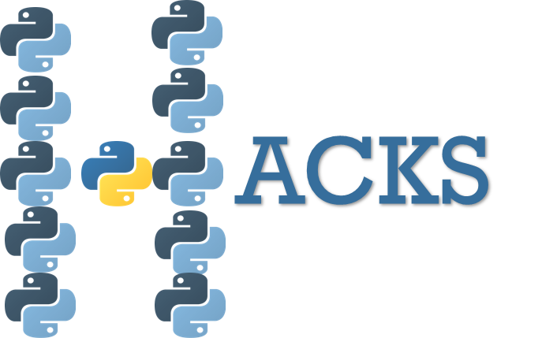

# PyHacks - Tutorials to start you from beginner to winner!

PyHacks is a tutorial repo managed by Gary Hutson from hutsons-hacks.info. This has been created to enable people to get up to speed quickly and to enable people to learn from my pain of learning Python about 4 years ago. This will act as a support to my YouTube tutorials. 

## What's contained
The list below shows all the current files for getting up to speed with Python quickly:

- Lists - Python's main data type
- Tuples - Python's immutable type (cannot be changed)
- Sets
- Functions
- Lambda Functions
- Pandas
- Numpy

